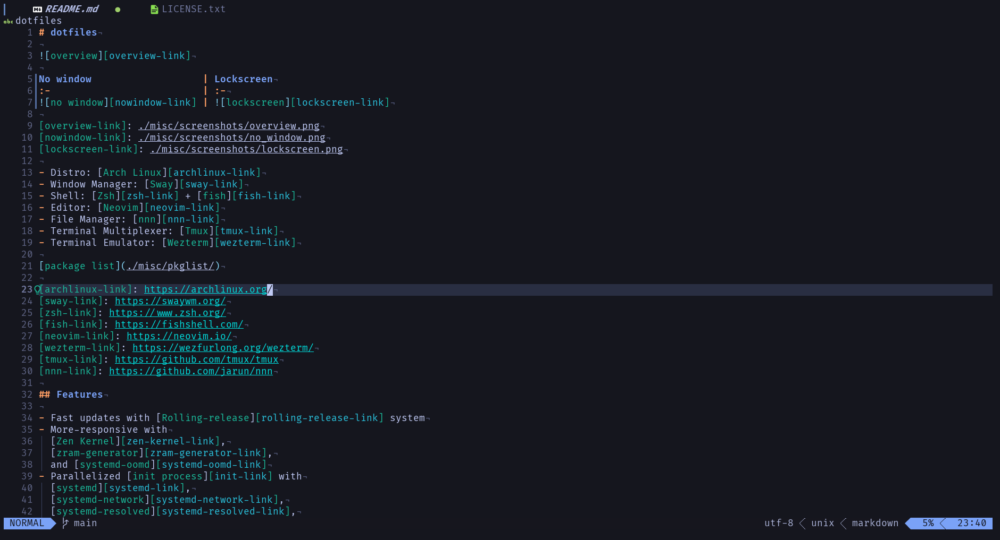
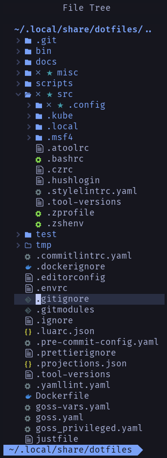
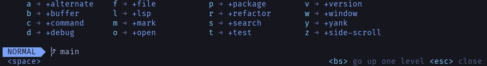
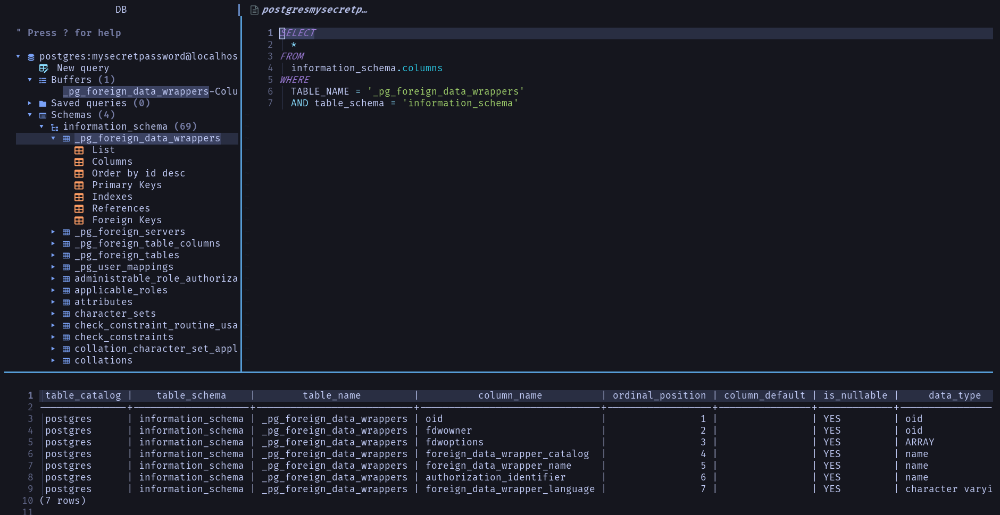
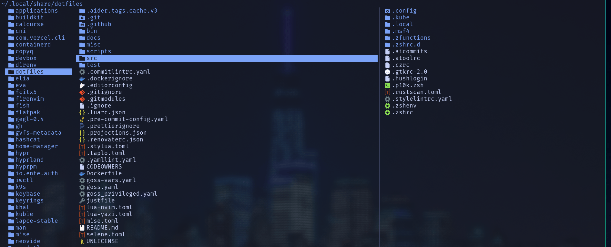
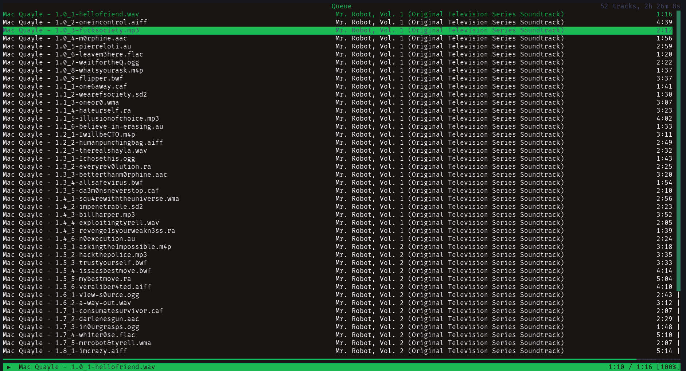
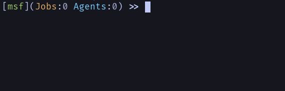
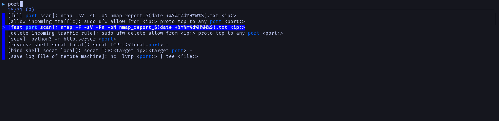

# dotfiles

![overview][overview-link]

| Bootsplash                          | Login screen                       |
| :---------------------------------- | :--------------------------------- |
| ![bootsplash-link][bootsplash-link] | ![login-screen][login-screen-link] |

| No window                   | Lock screen                      |
| :-------------------------- | :------------------------------- |
| ![no window][nowindow-link] | ![lock-screen][lock-screen-link] |

[overview-link]: ./misc/screenshots/overview.png
[bootsplash-link]: ./misc/screenshots/bootsplash.png
[login-screen-link]: ./misc/screenshots/login_screen.png
[nowindow-link]: ./misc/screenshots/no_window.png
[lock-screen-link]: ./misc/screenshots/lock_screen.png

- Distro: [Arch Linux][archlinux-link]
- Dotfiles Manager: [chezmoi][chezmoi-link]
- Display Manager: [ly][ly-link]
- Window Manager: [Hyprland][hyprland-link]
- Shell: [Zsh][zsh-link]
- Editor: [Neovim][neovim-link]
- File Manager: [yazi][yazi-link]
- Terminal Multiplexer: [Tmux][tmux-link]
- Terminal Emulator: [Ghostty][ghostty-link]

[package list](./misc/pkglist/)

[archlinux-link]: https://archlinux.org/
[chezmoi-link]: https://www.chezmoi.io/
[ly-link]: https://github.com/fairyglade/ly
[hyprland-link]: https://hyprland.org/
[zsh-link]: https://www.zsh.org/
[neovim-link]: https://neovim.io/
[ghostty-link]: https://ghostty.org/
[tmux-link]: https://github.com/tmux/tmux
[yazi-link]: https://yazi-rs.github.io/

## Features

- Fast updates with [Rolling-release][rolling-release-link] system
- More-responsive with
  [Zen Kernel][zen-kernel-link],
  [zram-generator][zram-generator-link],
  [systemd-oomd][systemd-oomd-link],
  [irqbalance][irqbalance-link],
  [cpupower][cpupower-link],
  [tlp][tlp-link],
  and [thermald][thermald-link]
- Parallelized [init process][init-link] with
  [systemd][systemd-link],
  [systemd-network][systemd-network-link],
  [systemd-resolved][systemd-resolved-link],
  and [systemd-timesyncd][systemd-timesyncd-link]
- Secure [display server][display-server-link] with [Wayland protocol][wayland-link]
- Efficiently and automatically organize desktop with [Tiling Window Manager][tiling-window-manager-link]
- [Transparent file compression][transparent-file-compression-link]
  with [Btrfs][btrfs-link] and [zstd][zstd-link]
- Minimal latency [sound server][sound-server-link] with [PipeWire][pipe-wire-link]
- [Full-disk encryption (FDE)][fde-link] with
  [dm-crypt][dm-crypt-link],
  [LVM][lvm-link],
  [LUKS][luks-link],
  [systemd-cryptenroll][systemd-cryptenroll-link]
  and [TPM2][tpm-link]
- Passwordless sudo with [PAM U2F module][pam-u2f-module-link]
- User-related information encryption with [systemd-homed][systemd-homed-link]
- [Improving Boot process][boot-process-link] with
  [uncompressed initramfs][uncompressed-initramfs-link],
  [Silent boot][silent-boot-link],
  and [systemd-boot][systemd-boot-link]
- [UEFI Secure Boot][uefi-secure-boot-link] with [unified kernel image (UKI)][uki-link]
  and [sbctl][sbctl-link]
- Enhance password security with [1Password][1password-link] and [Ente Auth][ente-auth-link]
- End-to-end encryption (E2EE) with [Signal][signal-link],
  [Proton Mail][proton-mail-link], [Tresorit][tresorit-link],
  [Ente Photos][ente-photos-link], and [Obsidian][obsidian-link]
- Privacy focused web browsing
  - Search shortcuts for [DuckDuckGo][duckduckgo-link]
  - [Strict Enhanced Tracking Protection][strict-etp-link]
  - [HTTPS-Only Mode][https-only-mode-link]
  - [Multi-Account Containers][multi-account-containers-link]
  - [uBlock Origin][ublock-origin-link]
  - [LibRedirect][libredirect-link]
  - [LocalCDN][localcdn-link]
  - [ClearURLs][clearurls-link]
  - [CanvasBlocker][canvasblocker-link]
- Block incoming connections without allowed with [ufw][ufw-link]
- Detect rootkit and package vulnerabilities with [rkhunter][rkhunter-link] and [arch-audit][arch-audit-link]
- Support Onion over VPN with [Tor Browser][tor-browser-link] and [OpenVPN][openvpn-link]
- Prevent DNS leak and IPv6 leak
- Command abbreviation and snippets for pentesting with [zsh][zsh-link] and [pet][pet-link]
- Available a large amount of cyber security tools with [BlackArch repository][blackarch-link]
- Support for OSC
  - OSC 8 - hyperlinks (tmux + eza + rg + fd + delta + ls)
  - OSC 52 - clipboard integration for copy only (tmux + neovim)
  - OSC 133 - shell integration (tmux + powerlevel10k)
- Ergonomic keybinds with [keyd][keyd-link]
  - Thumb cluster
  - Dual function keys
    - xcape
    - Space Cadet shift

[rolling-release-link]: https://en.wikipedia.org/wiki/Rolling_release
[zen-kernel-link]: https://github.com/zen-kernel/zen-kernel
[zram-generator-link]: https://github.com/systemd/zram-generator
[systemd-oomd-link]: https://www.freedesktop.org/software/systemd/man/systemd-oomd.service.html
[irqbalance-link]: https://github.com/irqbalance/irqbalance
[cpupower-link]: https://github.com/torvalds/linux/tree/master/tools/power/cpupower
[tlp-link]: https://linrunner.de/tlp/index.html
[thermald-link]: https://github.com/intel/thermal_daemon
[uncompressed-initramfs-link]: https://bbs.archlinux.org/viewtopic.php?id=148172
[init-link]: https://wiki.archlinux.org/title/Init
[systemd-link]: https://systemd.io/
[systemd-network-link]: https://www.freedesktop.org/software/systemd/man/systemd.network.html
[systemd-resolved-link]: https://www.freedesktop.org/software/systemd/man/systemd-resolved.service.html
[systemd-timesyncd-link]: https://www.freedesktop.org/software/systemd/man/systemd-timesyncd.service.html
[tiling-window-manager-link]: https://en.wikipedia.org/wiki/Tiling_window_manager
[display-server-link]: https://en.wikipedia.org/wiki/Windowing_system#Display_server
[wayland-link]: https://wayland.freedesktop.org/
[transparent-file-compression-link]: https://btrfs.wiki.kernel.org/index.php/Compression
[btrfs-link]: https://btrfs.wiki.kernel.org/index.php/Main_Page
[zstd-link]: https://github.com/facebook/zstd
[sound-server-link]: https://en.wikipedia.org/wiki/Sound_server
[pipe-wire-link]: https://pipewire.org/
[fde-link]: https://wiki.archlinux.org/title/Dm-crypt/Encrypting_an_entire_system#LVM_on_LUKS
[dm-crypt-link]: https://en.wikipedia.org/wiki/Dm-crypt
[lvm-link]: https://en.wikipedia.org/wiki/Logical_Volume_Manager_(Linux)
[luks-link]: https://en.wikipedia.org/wiki/Linux_Unified_Key_Setup
[systemd-cryptenroll-link]: https://www.freedesktop.org/software/systemd/man/systemd-cryptenroll.html
[tpm-link]: https://en.wikipedia.org/wiki/Trusted_Platform_Module
[pam-u2f-module-link]: https://developers.yubico.com/pam-u2f/
[systemd-homed-link]: https://systemd.io/HOME_DIRECTORY/
[boot-process-link]: https://wiki.archlinux.org/title/Improving_performance/Boot_process
[silent-boot-link]: https://wiki.archlinux.org/title/Silent_boot
[systemd-boot-link]: https://www.freedesktop.org/software/systemd/man/systemd-boot.html
[uefi-secure-boot-link]: https://wiki.archlinux.org/title/Unified_Extensible_Firmware_Interface/Secure_Boot
[uki-link]: https://wiki.archlinux.org/title/Unified_kernel_image
[sbctl-link]: https://github.com/Foxboron/sbctl
[1password-link]: https://1password.com/
[ente-auth-link]: https://github.com/ente-io/ente/tree/main/auth#readme
[signal-link]: https://signal.org/
[ente-photos-link]: https://ente.io/
[obsidian-link]: https://obsidian.md/sync
[strict-etp-link]: https://support.mozilla.org/en-US/kb/enhanced-tracking-protection-firefox-desktop
[duckduckgo-link]: https://duckduckgo.com/
[https-only-mode-link]: https://support.mozilla.org/en-US/kb/https-only-prefs
[multi-account-containers-link]: https://support.mozilla.org/en-US/kb/containers
[ublock-origin-link]: https://ublockorigin.com/
[libredirect-link]: https://libredirect.github.io/
[localcdn-link]: https://www.localcdn.org/
[clearurls-link]: https://github.com/ClearURLs/Addon
[canvasblocker-link]: https://github.com/kkapsner/CanvasBlocker/
[ufw-link]: https://launchpad.net/ufw
[rkhunter-link]: https://rkhunter.sourceforge.net/
[arch-audit-link]: https://gitlab.com/ilpianista/arch-audit
[tor-browser-link]: https://www.torproject.org/download/
[openvpn-link]: https://openvpn.net/client/
[nordvpn-link]: https://nordvpn.com/
[pet-link]: https://github.com/knqyf263/pet
[blackarch-link]: https://blackarch.org
[keyd-link]: https://github.com/rvaiya/keyd
[bats-link]: https://bats-core.readthedocs.io/

## Requirements

- [VAIO SX14 | ALL BLACK EDITION - June 2023 model (VJS1468)][vaio-sx14-link]
- USB drive
- [YubiKey 4][yubikey-link]

[vaio-sx14-link]: https://store.vaio.com/shop/pages/allblack_sx1214-6g.aspx
[yubikey-link]: https://support.yubico.com/hc/en-us/articles/360013714599-YubiKey-4

## Usage

### Install Arch Linux

[without virtualization](./docs/install-archlinux-without-virtulization.md)

### Deploy dotfiles

```sh
chezmoi init n4vysh && chezmoi apply
```

### Configure Tresorit

Login Tresorit and sync tresor with following commands.

```sh
tresorit-cli login
tresorit-cli sync --start Documents --path ~/Documents
tresorit-cli sync --start Music --path ~/Music
tresorit-cli sync --start Pictures --path ~/Pictures
tresorit-cli sync --start Videos --path ~/Videos
```

### Configure Firefox

Install addons refer to the [collections][collections-link]
and restore settings from following files in [misc/firefox/](misc/firefox/) directory.

| Addon name                          | File name                                                |
| :---------------------------------- | :------------------------------------------------------- |
| [uBlock Origin][ublock-origin-link] | [ublock.txt](misc/firefox/ublock.txt)                    |
| [LibRedirect][libredirect-link]     | [libredirect.json](misc/firefox/canvas-libredirect.json) |
| [ZeroOmega][zero-omega-link]        | [zero_omega.bak](misc/firefox/zero_omega.bak)            |
| [Translate Web Pages][twp-link]     | [twp.txt](misc/firefox/twp.txt)                          |
| [CanvasBlocker][canvasblocker-link] | [canvas-blocker.json](misc/firefox/canvas-blocker.json)  |

[collections-link]: https://addons.mozilla.org/en-US/firefox/collections/17575539/n4vysh/
[zero-omega-link]: https://github.com/zero-peak/ZeroOmega
[twp-link]: https://github.com/FilipePS/Traduzir-paginas-web

### Test

Run `pre-commit run -a` to lint and format the source code with
[pre-commit][pre-commit-link]. pre-commit run following tools.

| Name                                                                                  | Target type                |
| :------------------------------------------------------------------------------------ | :------------------------- |
| [prettier][prettier-link]                                                             | JSON, YAML, Markdown files |
| [yamllint][yamllint-link]                                                             | YAML files                 |
| [taplo][taplo-link]                                                                   | TOML files                 |
| [markdownlint-cli2][markdownlint-cli2-link]                                           | Markdown files             |
| [shfmt][shfmt-link] + [shellharden][shellharden-link] + [shellcheck][shellcheck-link] | shell scripts              |
| [commitlint][commitlint-link]                                                         | commit messages            |
| zsh --no-exec                                                                         | zsh files                  |
| hyprctl configerrors                                                                  | hyprland config file       |
| [selene][selene-link] + [stylua][stylua-link]                                         | lua files                  |
| [editorconfig-checker][ec-link]                                                       | all files                  |
| [bats][bats-link]                                                                     | etc files                  |

[pre-commit-link]: https://pre-commit.com/
[prettier-link]: https://prettier.io/
[yamllint-link]: https://github.com/adrienverge/yamllint
[taplo-link]: https://taplo.tamasfe.dev/
[markdownlint-cli2-link]: https://github.com/DavidAnson/markdownlint-cli2
[shfmt-link]: https://github.com/mvdan/sh
[shellharden-link]: https://github.com/anordal/shellharden
[shellcheck-link]: https://www.shellcheck.net/
[commitlint-link]: https://commitlint.js.org/#/
[selene-link]: https://github.com/Kampfkarren/selene
[stylua-link]: https://github.com/JohnnyMorganz/StyLua
[ec-link]: https://github.com/editorconfig-checker/editorconfig-checker

## Custom keybinds

### keyd

| Physical key  | Mapped To      | Note                        |
| :------------ | :------------- | :-------------------------- |
| `Capslock`    | N/A            |                             |
| `Alt (Right)` | `Ctrl (Right)` | `Escape` when pressed alone |
| `Alt (Left)`  | `Alt (Left)`   |                             |

### Tmux

prefix is `C-j`

| Key table    | Keys  | Description                                            |
| :----------- | :---- | :----------------------------------------------------- |
| root         | `C-j` | Send `C-j`                                             |
| root         | `v`   | Paste from clipboard                                   |
| root         | `C-c` | Create new session                                     |
| root         | `C-l` | Switch last window                                     |
| root         | `L`   | Switch last session                                    |
| root         | `C-s` | Create a new pane by vertical split                    |
| root         | `C-v` | Create a new pane by horizontal split                  |
| root         | `C-k` | List keybindings                                       |
| root         | `C-m` | Show manual                                            |
| root         | `e`   | Edit config of tmux                                    |
| root         | `C-e` | Edit and send commands                                 |
| root         | `C-o` | Goto open-mode table                                   |
| open-mode    | `b`   | Create session for BGM                                 |
| open-mode    | `c`   | Open container client in new window                    |
| open-mode    | `d`   | Open database client in new window                     |
| open-mode    | `C-d` | Create session to edit documents                       |
| open-mode    | `M-d` | Create session to edit dotfiles                        |
| open-mode    | `e`   | Open editor in new window                              |
| open-mode    | `f`   | Open file manager in new window                        |
| open-mode    | `m`   | Open system monitor in new window                      |
| open-mode    | `C-m` | Open system monitor with privileged user in new window |
| open-mode    | `p`   | Open news reader for package manager                   |
| open-mode    | `s`   | Open new session with fuzzy finder                     |
| open-mode    | `C-s` | Paste snippet with fuzzy finder                        |
| open-mode    | `t`   | Open translate tool in new window                      |
| open-mode    | `v`   | Open git client in new window                          |
| copy-mode-vi | `C-t` | Translate selected text                                |
| copy-mode-vi | `C-e` | Send selected file path to editor                      |

### Neovim

| Mode   | Keys         | Description                        |
| :----- | :----------- | :--------------------------------- |
| Normal | `<C-s>`      | Save the current file              |
| Normal | `g<C-s>`     | Save all changed files             |
| Normal | `<C-w><C-q>` | Quit without writing               |
| Normal | `g<C-e>`     | Reload current buffer              |
| Normal | `gq`         | Delete current buffer              |
| Normal | `g<C-q>`     | Delete current buffer without save |
| Normal | `g<C-n>`     | Create new buffer                  |
| Visual | `g/`         | Search forward in the range        |
| Visual | `g?`         | Search backward in the range       |
| Normal | `<C-/>`      | Show custom keymaps                |
| Normal | `g<C-/>`     | Show all custom keymaps            |

### yazi

| Keys      | Description                     |
| :-------- | :------------------------------ |
| `g` + `r` | Goto git root directory         |
| `,` + `d` | Diff for selection items        |
| `,` + `e` | Open editor                     |
| `,` + `l` | Show git log for selection item |
| `,` + `T` | Restore trashed files           |
| `,` + `u` | Show disk usage                 |
| `,` + `v` | Open git client                 |

### lazygit

| Context | Keys  | Description                               |
| :------ | :---- | :---------------------------------------- |
| status  | `c`   | Clone repository with ghq                 |
| status  | `o`   | Open browser with git-open                |
| status  | `f`   | Open file manager                         |
| files   | `c`   | Commit with commitizen                    |
| files   | `f`   | Open selected file with file manager      |
| commits | `C-t` | Continue the revert operation in progress |

## List of applications

| Category                      | Name                                                                                              |
| :---------------------------- | :------------------------------------------------------------------------------------------------ |
| Taskbar                       | [waybar][waybar-link]                                                                             |
| Launcher                      | [rofi-wayland][rofi-wayland-link]                                                                 |
| Web Browser                   | [Firefox][firefox-link]                                                                           |
| Password Manager              | [1Password][1password-link] + [Ente Auth][ente-auth-link]                                         |
| VPN client                    | [OpenVPN][openvpn-link] + [NordVPN][nordvpn-link]                                                 |
| Mail client                   | [Proton Mail][proton-mail-link]                                                                   |
| Instant messaging clients     | [Signal][signal-link]                                                                             |
| Audio player                  | [ncspot][ncspot-link]                                                                             |
| Media player                  | [mpv][mpv-link]                                                                                   |
| Cloud synchronization clients | [Tresorit][tresorit-link]                                                                         |
| Screenshot                    | [grimblast][grimblast-link]                                                                       |
| Screen record                 | [wf-recorder][wf-recorder-link] + [slurp][slurp-link]                                             |
| Notification                  | [swaync][swaync-link]                                                                             |
| Font                          | [Fira Code][firacode-link] + [NerdFontsSymbolsOnly][nerd-font-link] + [Noto Sans][noto-sans-link] |
| GTK Theme                     | [Fluent gtk][fluent-gtk-link]                                                                     |
| QT Theme                      | [Fluent kde][fluent-kde-link]                                                                     |
| Overlay bar                   | [wob][wob-link]                                                                                   |
| System information tool       | [fastfetch][fastfetch-link]                                                                       |

[waybar-link]: https://github.com/Alexays/Waybar
[rofi-wayland-link]: https://github.com/lbonn/rofi
[firefox-link]: https://www.mozilla.org/en-US/firefox/new/
[proton-mail-link]: https://proton.me/mail/download
[tresorit-link]: https://toresorit.com
[ncspot-link]: https://github.com/hrkfdn/ncspot
[mpv-link]: https://mpv.io/
[grimblast-link]: https://github.com/hyprwm/contrib/tree/main/grimblast
[slurp-link]: https://github.com/emersion/slurp
[wf-recorder-link]: https://github.com/ammen99/wf-recorder
[swaync-link]: https://github.com/ErikReider/SwayNotificationCenter
[firacode-link]: https://github.com/tonsky/FiraCode
[nerd-font-link]: https://github.com/ryanoasis/nerd-fonts/tree/master/patched-fonts/NerdFontsSymbolsOnly
[noto-sans-link]: https://fonts.google.com/noto/specimen/Noto+Sans
[fluent-gtk-link]: https://github.com/vinceliuice/Fluent-gtk-theme
[fluent-kde-link]: https://github.com/vinceliuice/Fluent-kde
[wob-link]: https://github.com/francma/wob
[fastfetch-link]: https://github.com/fastfetch-cli/fastfetch

## Screenshots

### rofi-wayland


### wlogout


### swaync


### waybar


If rkhunter or arch-audit found some problem, show following.


### nvim

- [tokyonight.nvim][tokyonight-link]
- [bufferline.nvim][bufferline-link]
- [dropbar.nvim][dropbar-link]
- [nvim-lspconfig][lspconfig-link]
- [nvim-treesitter][treesitter-link]
- [statuscol.nvim][statuscol-link]
- [lualine.nvim][lualine-link]

[tokyonight-link]: https://github.com/folke/tokyonight.nvim
[bufferline-link]: https://github.com/akinsho/bufferline.nvim
[dropbar-link]: https://github.com/Bekaboo/dropbar.nvim
[lspconfig-link]: https://github.com/neovim/nvim-lspconfig
[treesitter-link]: https://github.com/nvim-treesitter/nvim-treesitter
[statuscol-link]: https://github.com/luukvbaal/statuscol.nvim
[lualine-link]: https://github.com/nvim-lualine/lualine.nvim



[Telescope.nvim](https://github.com/nvim-telescope/telescope.nvim)


[nvim-tree.lua](https://github.com/nvim-tree/nvim-tree.lua)



[which-key.nvim](https://github.com/folke/which-key.nvim)



[hydra.nvim](https://github.com/anuvyklack/hydra.nvim)


[wilder.nvim](https://github.com/gelguy/wilder.nvim)


[vim-dadbod-ui](https://github.com/kristijanhusak/vim-dadbod-ui)



### yazi



### [lazygit](https://github.com/jesseduffield/lazygit)


### [lazydocker](https://github.com/jesseduffield/lazydocker)


### ncspot



### [btop](https://github.com/aristocratos/btop)


### [msf](https://github.com/rapid7/metasploit-framework)



### pet



## Tips

[on WSL2](./docs/install-archlinux-on-wsl2.md)

## License

This project distributed under the [Unlicense][unlicense-link].
See the [UNLICENSE](./UNLICENSE) file for details.

[unlicense-link]: https://choosealicense.com/licenses/unlicense/

<!-- markdownlint-configure-file
{
  "MD013": { "tables": false }
}
-->
