# 🖼️ Screenshots

## rofi

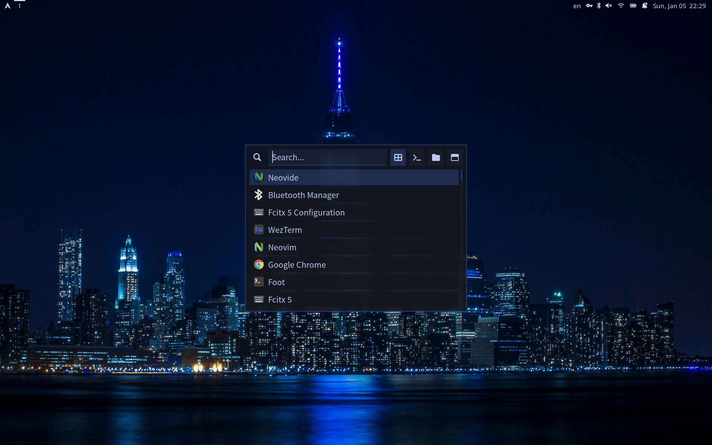

## wlogout

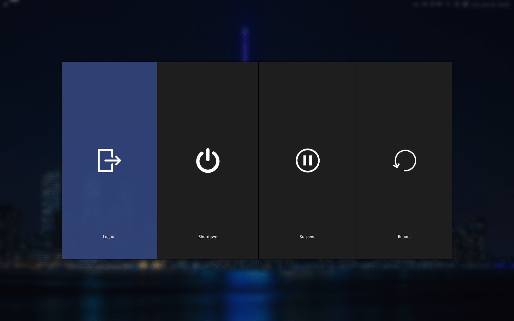

## swaync

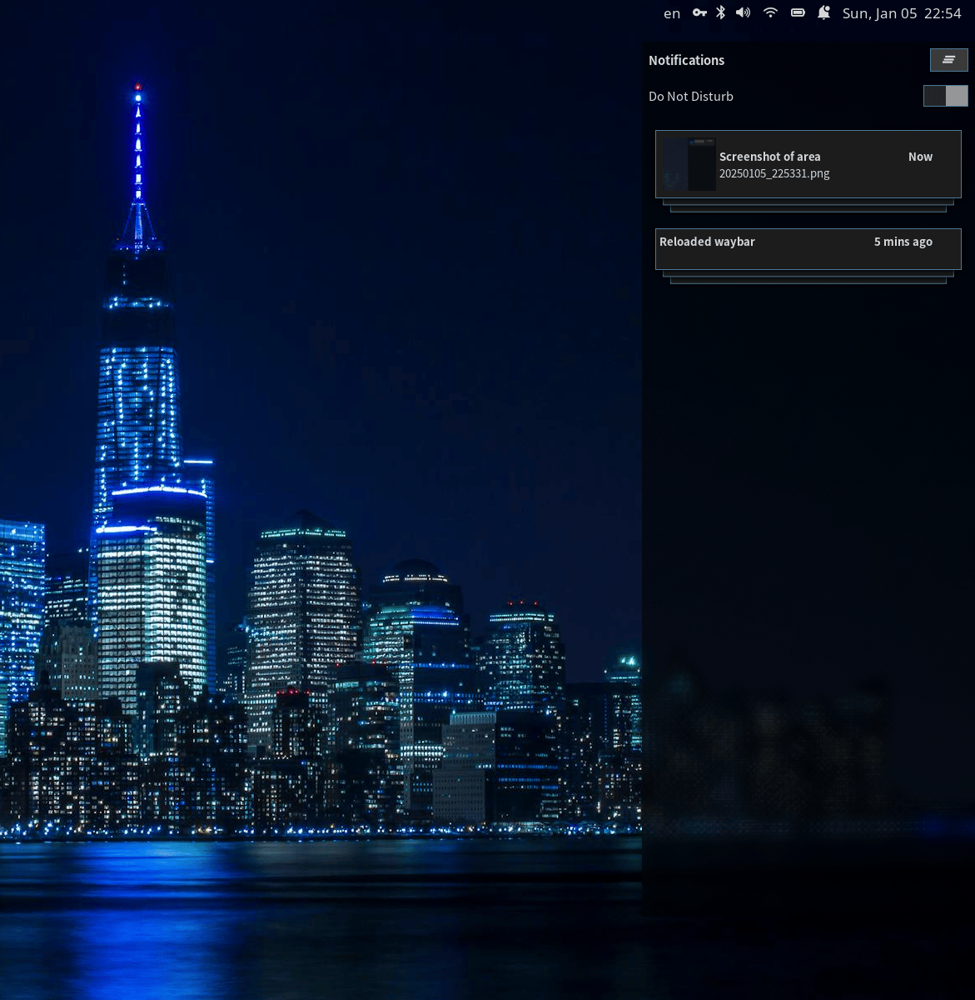

## waybar

If rkhunter or arch-audit found some problem, show following.

## nvim

- [tokyonight.nvim][tokyonight-link]
- [bufferline.nvim][bufferline-link]
- [dropbar.nvim][dropbar-link]
- [nvim-lspconfig][lspconfig-link]
- [nvim-treesitter][treesitter-link]
- [statuscol.nvim][statuscol-link]
- [lualine.nvim][lualine-link]

[tokyonight-link]: https://github.com/folke/tokyonight.nvim
[bufferline-link]: https://github.com/akinsho/bufferline.nvim
[dropbar-link]: https://github.com/Bekaboo/dropbar.nvim
[lspconfig-link]: https://github.com/neovim/nvim-lspconfig
[treesitter-link]: https://github.com/nvim-treesitter/nvim-treesitter
[statuscol-link]: https://github.com/luukvbaal/statuscol.nvim
[lualine-link]: https://github.com/nvim-lualine/lualine.nvim

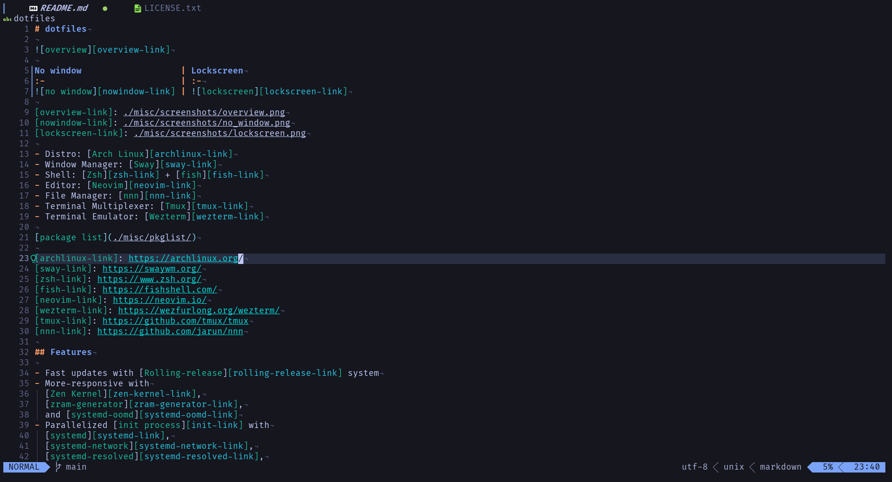

[Telescope.nvim](https://github.com/nvim-telescope/telescope.nvim)

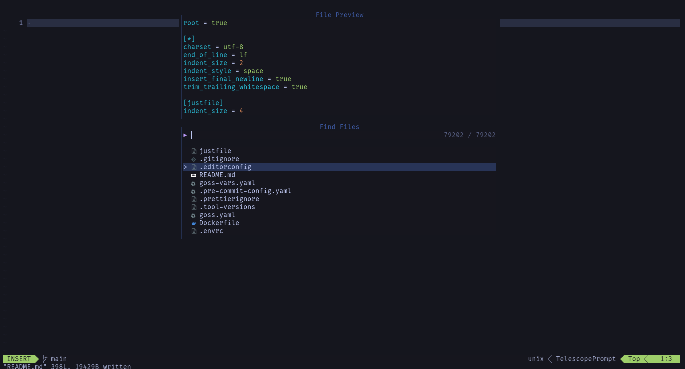

[nvim-tree.lua](https://github.com/nvim-tree/nvim-tree.lua)

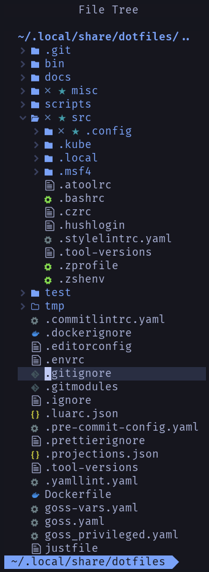

[which-key.nvim](https://github.com/folke/which-key.nvim)

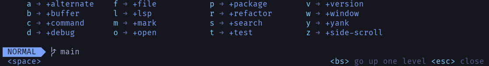

[hydra.nvim](https://github.com/anuvyklack/hydra.nvim)

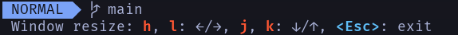

[wilder.nvim](https://github.com/gelguy/wilder.nvim)

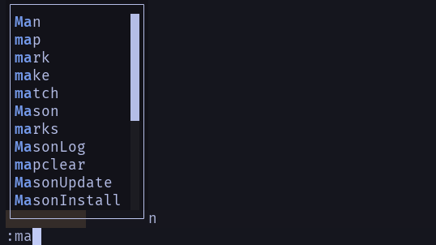

[vim-dadbod-ui](https://github.com/kristijanhusak/vim-dadbod-ui)

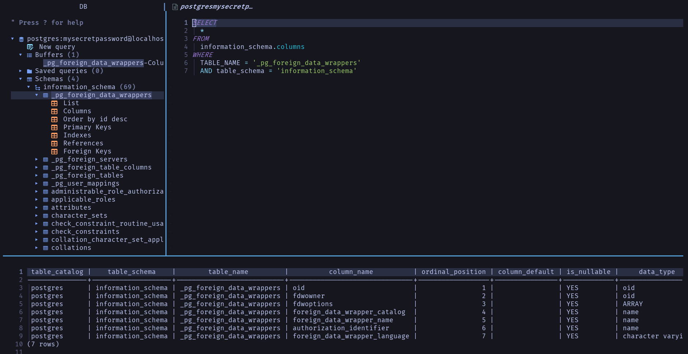

## yazi

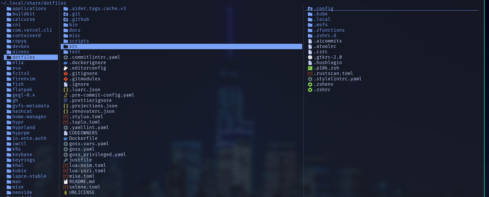

## [lazygit](https://github.com/jesseduffield/lazygit)

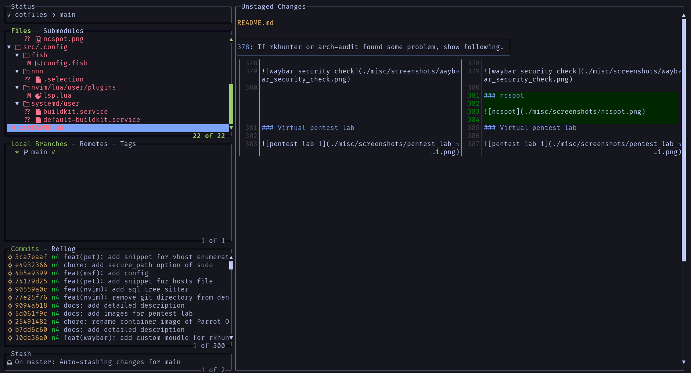
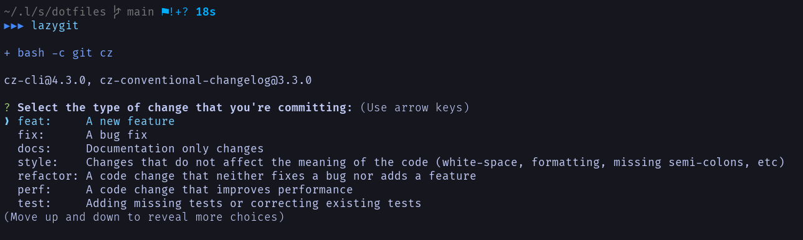

## [lazydocker](https://github.com/jesseduffield/lazydocker)

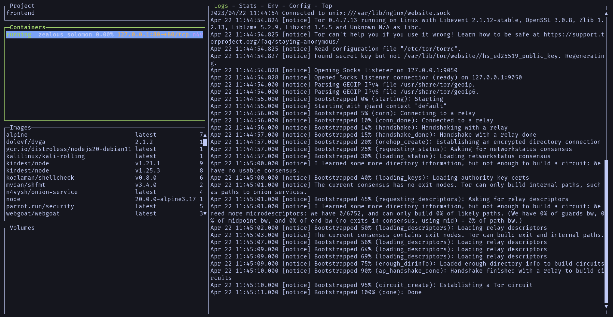

## [btop](https://github.com/aristocratos/btop)

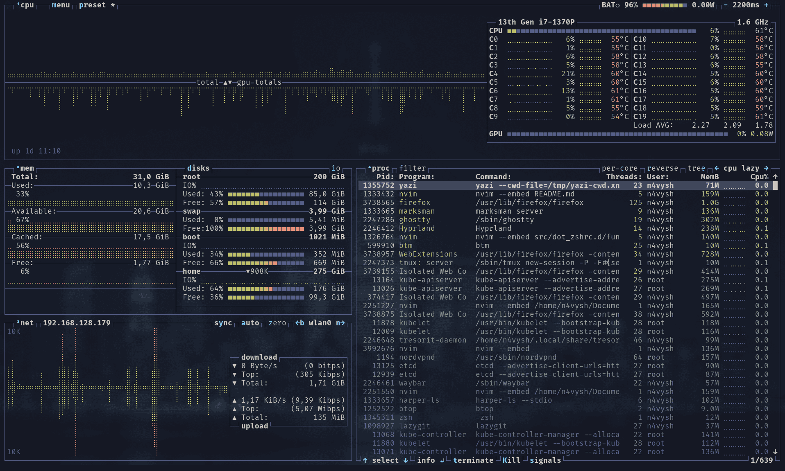

## [msf](https://github.com/rapid7/metasploit-framework)

## pet

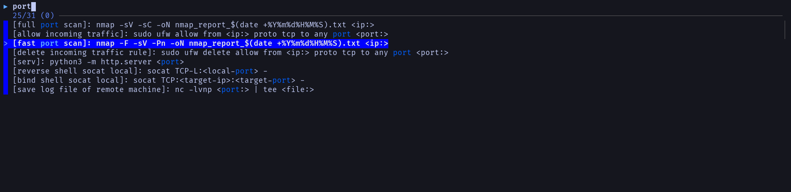
